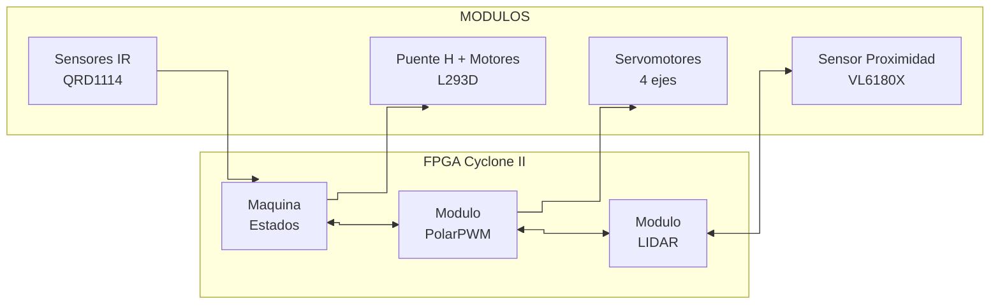
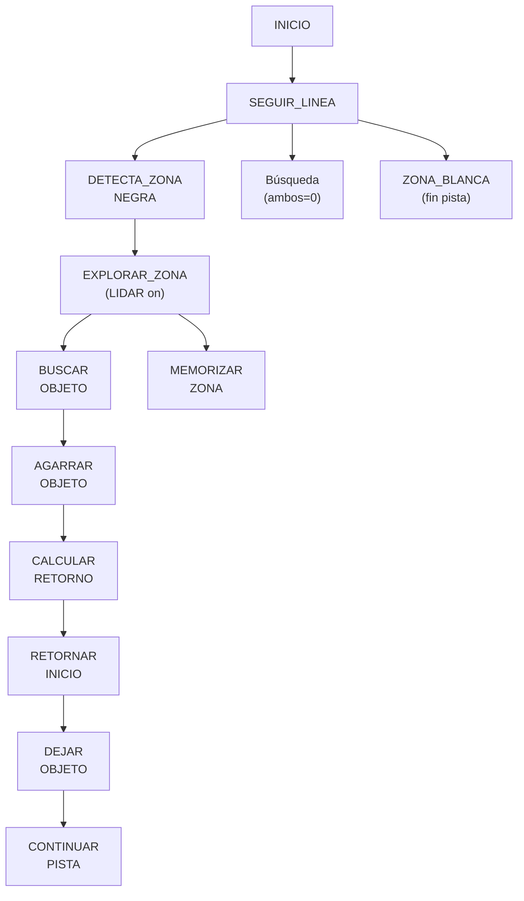

# Robot Seguidor de Línea con Brazo Robótico - Documentación

## Proyecto por Actronix09

---

## Índice

1. [Resumen](#resumen)
2. [Vistas del Sistema](#vistas-del-sistema)
3. [Arquitectura](#arquitectura-del-sistema)
4. [Módulos VHDL](#módulos-vhdl)
5. [Máquina de Estados](#máquina-de-estados)
6. [Conversión Polar-PWM](#conversión-polar-pwm)
7. [Asignación de Pines](#asignación-de-pines)
8. [Lista de Materiales](#lista-de-materiales)
9. [Retroalimentación LEDs](#retroalimentación-leds)
10. [Referencias](#c-referencias-bibliográficas)

---

## Resumen

Robot seguidor de línea autónomo con brazo robótico de 4 grados de libertad controlado por FPGA Cyclone IV. Integra sensores QRD1114 para seguimiento de línea, sensor VL6180X para detección de objetos (LIDAR), y control PWM para posicionamiento del brazo.

**Características:**
- Navegación autónoma por pista de línea negra
- Detección y localización de objetos con LIDAR
- Brazo de 4 ejes con control de posición preciso
- Sistema de adquisición y depósito de objetos
- Retroalimentación visual mediante LEDs

---

## Vistas del Sistema

### Esquemático Eléctrico


*Figura 1: Diagrama esquemático del sistema mostrando la interconexión de sensores QRD1114, controlador L293D, reguladores de voltaje y conexiones a la FPGA.*

**Componentes principales:**
- **Sensores QRD1114:** Detectan la línea negra mediante reflexión infrarroja
- **LM393:** Comparadores para señal digital de sensores
- **L293D:** Puente H para control de motores DC
- **VL6180X:** Sensor de distancia por tiempo de vuelo (ToF)
- **Reguladores:** LM317 para 5V y 3.3V estables

### PCB Diseñado


*Figura 2: Diseño de la PCB mostrando la distribución de componentes y ruteo de pistas. Dimensiones: 100mm x 84mm.*

**Características del PCB:**
- **Capas:** 2 capas (superior e inferior)
- **Conectores:** Headers de 2.54mm para fácil conexión
- **Alimentación:** Jack DC barrel + reguladores lineales
- **Sensores:** 3 módulos QRD1114 configurables
- **Motores:** Conectores para 2 motores DC con reductora

### Modelo 3D del Robot


*Figura 3: Modelo 3D del robot con multiples ángulos.*

**Ejes del brazo:**
- **Eje 1 (φ):** Base rotativa
- **Eje 2 (θ₁):** Primer segmento
- **Eje 3 (θ₂):** Segundo segmento 
- **Eje 4 (θ₃):** Tercer segmento con pinza

---

## Arquitectura del Sistema


---

## Módulos VHDL

### 1. SeguidorLinea_Brazo (Principal)
**Archivo:** `SeguidorLinea_Brazo.vhd`

Módulo superior que integra todos los subsistemas.

**Señales principales:**
| Señal | Tipo | Descripción |
|-------|------|-------------|
| `clk` | in | Reloj 50 MHz |
| `reset` | in | Reset (activo bajo) |
| `servo_*` | out | PWM servomotores |
| `sensor_*` | in | Sensores QRD1114 |
| `motor*_in*` | out | Control motores DC |
| `i2c_*` | in/out | I2C VL6180X |

### 2. polarPWM
**Archivo:** `polarPWM.vhd`

Convierte coordenadas polares a PWM para 4 servomotores.
- Frecuencia: 50Hz (20ms)
- Rango: 0.5ms - 2.0ms duty cycle
- Resolución: 8 bits (0-180°)
- LUT: 181 valores precalculados

### 3. LIDAR
**Archivo:** `LIDAR.vhd`

Controla el VL6180X mediante I2C para escanear de -45° a +45°.
- 19 puntos de escaneo
- Resolución: 5° por paso
- I2C a 100 kHz
- Algoritmo: mínimo + promedio ponderado

**Estados:** IDLE → INIT → STARTING → WAIT_M → READ_M → NEXT_PT → REFINE → CALC → OUTPUT → COMPLETE

### 4. MaquinaEstados
**Archivo:** `MaquinaEstados.vhd`

Controla navegación autónoma siguiendo línea negra.

**Estados principales:**
INICIO → SEGUIR_LINEA → DETECTA_ZONA_NEGRA → EXPLORAR_ZONA → BUSCAR_OBJETO → AGARRAR_OBJETO → CALCULAR_RETORNO → RETORNAR_INICIO → DEJAR_OBJETO → MEMORIZAR_ZONA → CONTINUAR_PISTA → ZONA_BLANCA → ERROR

---

## Máquina de Estados



**Transiciones clave:**
| Condición | Transición |
|-----------|------------|
| 3 sensores en negro | SEGUIR_LINEA → DETECTA_ZONA_NEGRA |
| LIDAR < 200mm | EXPLORAR_ZONA → BUSCAR_OBJETO |
| LIDAR >= 200mm | EXPLORAR_ZONA → MEMORIZAR_ZONA |
| Distancia < 50mm | BUSCAR_OBJETO → AGARRAR_OBJETO |
| Timeout retorno | RETORNAR_INICIO → ERROR |

## Conversión Polar-PWM

El módulo `polarPWM` convierte coordenadas polares a señales PWM para los 4 servomotores.

**Especificaciones:**
- Frecuencia: 50Hz (20ms)
- Duty cycle: 0.5ms - 2.0ms
- Resolución: 8 bits (0-180°)
- LUT: 181 valores precalculados

**Fórmula:**
```
PWM = PWM_MIN + (ángulo × PWM_RANGE / 180)
donde: PWM_MIN=25000, PWM_MAX=100000
```

**Tabla de conversión:**
| Ángulo | Duty Cycle | Tiempo |
|--------|------------|--------|
| 0° | 25000 | 0.50ms |
| 45° | 43750 | 0.875ms |
| 90° | 62500 | 1.25ms |
| 135° | 81250 | 1.625ms |
| 180° | 100000 | 2.00ms |


## Asignación de Pines

| Componente | Señal | Pin FPGA | Dirección | Notas |
|------------|-------|----------|-----------|-------|
| **Reloj** | clk_50 | | IN | 50 MHz |
| **Reset** | reset | | IN | Activo bajo |
| **Sensores Línea** | | | | |
| QRD1114-1 | sensor_izq | | IN | Izquierda |
| QRD1114-2 | sensor_der | | IN | Derecha |
| QRD1114-3 | sensor_cent | | IN | Central |
| QRD1114-4 | sensor_del | | IN | Delantero |
| QRD1114-5 | sensor_tras | | IN | Trasero |
| **Motores DC** | | | | |
| Motor 1 | motor1_in1 | | OUT | Dirección A |
| Motor 1 | motor1_in2 | | OUT | Dirección B |
| Motor 1 | motor1_en | | OUT | PWM Velocidad |
| Motor 2 | motor2_in1 | | OUT | Dirección A |
| Motor 2 | motor2_in2 | | OUT | Dirección B |
| Motor 2 | motor2_en | | OUT | PWM Velocidad |
| **Servomotores** | | | | |
| Eje 1 (φ) | servo_phi | | OUT | Base |
| Eje 2 (θ₁) | servo_theta1 | | OUT | Segmento 1 |
| Eje 3 (θ₂) | servo_theta2 | | OUT | Segmento 2 |
| Eje 4 (θ₃) | servo_theta3 | | OUT | Pinza |
| **LIDAR VL6180X** | | | | |
| I2C Clock | i2c_scl | | OUT | 100 kHz |
| I2C Data | i2c_sda | | INOUT | Bidireccional |
| I2C GPIO | i2c_gpio | | IN | Opcional |
| **Debug** | | | | |
| LED Estado | led_estado | | OUT | Parpadeo 1Hz |
| LED Error | led_error | | OUT | Indicador fallo |
| Debug [15:0] | debug_out | | OUT | Datos depuración |
| **Configuración** | | | | |
| Modo [2:0] | sw_mode | | IN | Select modo |
| Velocidad [1:0] | sw_vel | | IN | Select velocidad |
| Test | sw_test | | IN | Modo test |


## Lista de Materiales

- ALTERA FPGA Cyclone II EP2C5T144 Mini placa
- PCB personalizada
- Piezas de impresión 3D en PLA y TPU
- Insertos de latón M2 y M3
- Tornillos M2, M3 y M4
- Tuercas M3 y M4
- Motores reductores
- Capacitor Electrolítico 16V (470 uF, 100 uF, 1000 uF)
- Capacitor Cerámico 50V 100nF
- Jack DC Hembra DC-005-2.1
- Base Socket DIP-16 y DIP-8
- LM393P Comparador Diferencial Dual
- Tira Header Macho y Hembra 2.54mm
- Plug DC 5.5mm x 2.1mm
- STPS0560Z Diodo 60V 500mA SMD
- LD1117AS33TR Regulador 3.3V 1A
- LD1117S50CTR Regulador 5V 800mA
- Resistor 470 Ohms 1/4W 1206 SMD
- Resistor 10K Ohms 1/4W 1206 SMD
- LED Rojo SMD 1206
- Potenciómetro de Precisión 3362P 10k
- Conector XT30 Par Macho Hembra
- Batería 18650 7.4V 2S1P 2200mAh
- Conectores Dupont Hembra 2.54mm (3P, 4P, 7P)
- Servomotor SG90 RC 9g
- Separador de Latón M3 (5mm, 10mm, 20mm)
- CY-15A Rueda Loca Universal de Metal
- VL6180X Sensor de Distancia Óptico
- Alambre de Cobre 30 AWG

---

## Retroalimentación LEDs

El sistema incluye 3 LEDs para diagnóstico:

| LED | Estado | Significado |
|-----|--------|-------------|
| `led_estado` | Parpadeo 1Hz | Sistema operativo |
| `led_error` | Encendido | Error en máquina de estados |
| `debug_out[15:0]` | Variable | Datos LIDAR y estado |

**Diagnóstico rápido:**
| led_estado | led_error | Significado |
|------------|-----------|-------------|
| Parpadeando | Apagado | Normal |
| Parpadeando | Encendido | Error |
| Apagado | Apagado | Sin energia |

---

## Archivos del Proyecto

```
SeguidorLinea_Brazo/
├── Codigo/           # VHDL y Quartus
│   ├── *.vhd         # Módulos VHDL
│   ├── *.qpf         # Proyecto
│   └── output_files/ # SOF para programación
├── Imagenes/         # Renderizados
├── Documentos/       # PDFs y STL
└── README.md
```

---

### C. Referencias Bibliográficas

1. Altera Corporation. "Cyclone IV Device Handbook." 2023.
2. Pololu Corporation. "QRD1114 Reflective Optical Sensor." Datasheet.
3. STMicroelectronics. "VL6180X Time-of-Flight Distance Sensor." Datasheet.
4. Texas Instruments. "L293D Quadruple Half-H Driver." Datasheet.
5. IEEE Standard 1076-2008. "VHDL Language Reference Manual."

### D. Enlaces de Interés

- **Repositorio GitHub:** [github.com/Actronix09/SeguidorLinea_Brazo](https://github.com/Actronix09/SeguidorLinea_Brazo)
- **Quartus Prime Lite:** [Descargar](https://www.intel.com/content/www/us/en/software-kit/750675/quartus-prime-lite-edition-version-23-1-0-991-linux-installation.html)

---

**Última actualización:** 10 de Mayo del 2026
