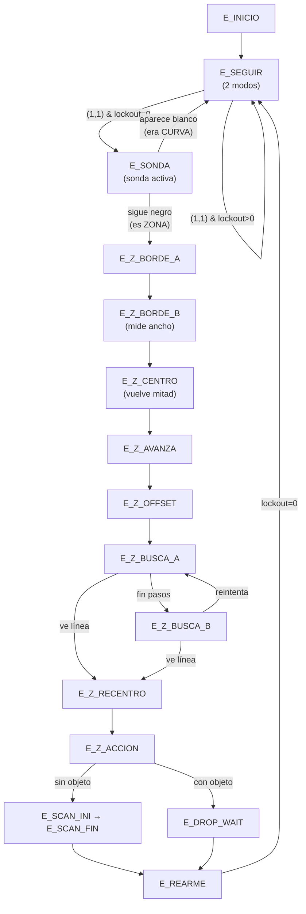

# Robot Seguidor de Línea con Brazo Robótico - Documentación

## Proyecto por Actronix09

---

## Índice

1. [Resumen](#resumen)
2. [Vistas del Sistema](#vistas-del-sistema)
3. [Arquitectura](#arquitectura-del-sistema)
4. [Módulos VHDL](#módulos-vhdl)
5. [Máquina de Estados](#máquina-de-estados)
6. [Pívot Pulsado por Pasos (las 4 perillas)](#pívot-pulsado-por-pasos-las-4-perillas)
7. [Conversión Polar-PWM](#conversión-polar-pwm)
8. [Asignación de Pines](#asignación-de-pines)
9. [Lista de Materiales](#lista-de-materiales)
10. [Retroalimentación LEDs](#retroalimentación-leds)
11. [Referencias](#c-referencias-bibliográficas)

---

## Resumen

Robot seguidor de línea autónomo ("Sísifo") con brazo robótico de 4 grados de libertad (+ pinza) controlado por una FPGA **Cyclone II EP2C5T144C7** (placa RZ-EasyFPGA A2.2, reloj de 50 MHz). Integra sensores QRD1114 para seguimiento de línea, un sensor de distancia por tiempo de vuelo **VL53L0X** usado como escáner LIDAR montado en el brazo, y control PWM para los 5 servos.

**Características:**
- Navegación autónoma de **dos modos** (recta y curva) sobre línea negra delgada (~20 mm) que pasa **entre** los dos sensores.
- Detección de **zona** (ensanchamiento de la línea) discriminada de una curva con una **sonda activa**.
- Maniobra de zona: centrado por bordes, avance, búsqueda y recentrado de la línea de salida usando un **pívot pulsado por pasos**.
- Escáner LIDAR 2D con el brazo: localiza el objeto más cercano (cubo) y lo agarra; **watchdog** que re-escanea solo si el sensor I2C se cuelga.
- Brazo de 4 ejes + pinza con control de posición por rampa.
- Retroalimentación visual mediante 3 LEDs.

> El diseño completo (todos los módulos integrados) ocupa **4 517 / 4 608 LEs (98 %)** del EP2C5 — cabe pero muy justo.

---

## Vistas del Sistema

### Esquemático Eléctrico


*Figura 1: Diagrama esquemático del sistema mostrando la interconexión de sensores QRD1114, controlador L293D, reguladores de voltaje y conexiones a la FPGA.*

**Componentes principales:**
- **Sensores QRD1114:** Detectan la línea negra mediante reflexión infrarroja.
- **LM393:** Comparadores para señal digital de sensores.
- **L293D:** Puente H para control de motores DC.
- **VL53L0X:** Sensor de distancia por tiempo de vuelo (ToF) usado como LIDAR.
- **Reguladores:** LD1117 para 5 V y 3.3 V estables.

### PCB Diseñado


*Figura 2: Diseño de la PCB mostrando la distribución de componentes y ruteo de pistas. Dimensiones: 100mm x 84mm.*

**Características del PCB:**
- **Capas:** 2 capas (superior e inferior).
- **Conectores:** Headers de 2.54mm para fácil conexión.
- **Alimentación:** Jack DC barrel + reguladores lineales.
- **Sensores:** módulos QRD1114 configurables.
- **Motores:** Conectores para 2 motores DC con reductora.

### Modelo 3D del Robot


*Figura 3: Modelo 3D del robot con multiples ángulos.*

**Ejes del brazo:**
- **Eje 1 (φ):** Base rotativa.
- **Eje 2 (θ₁):** Primer segmento (hombro).
- **Eje 3 (θ₂):** Segundo segmento (codo).
- **Eje 4 (θ₃):** Tercer segmento (muñeca) + pinza.

---

## Arquitectura del Sistema

El top `SeguidorLinea_Brazo` integra 5 submódulos. La `MaquinaEstados` navega y, en cada zona, dispara el brazo según lleve o no objeto; el `LIDAR` escanea con el brazo y entrega el punto más cercano; `grab_ctrl` orquesta el ciclo del brazo (agarre/HOLD/depósito) y `polarPWM` genera el PWM de los 5 servos.

```
                         FPGA Cyclone II EP2C5T144C7  (50 MHz)
   QRD1114 x2  ─────────────►┌──────────────────┐
   (izq/der)                 │  MaquinaEstados   │──(A1/A2/B1/B2 PWM)──► L293D ─► 2 motores DC
                             │  (seguidor línea) │
                  start_scan │   ▲ has_object    │ trigger_drop
                       ┌─────┘   │ arm_ready      └─────┐
                       ▼         │                      ▼
              ┌──────────────┐   │              ┌──────────────────┐
   VL53L0X ──►│    LIDAR     │───┴─ found ──────►│    grab_ctrl     │
   (I2C ToF)  │  (escáner 2D)│  scan_active/     │ (ciclo del brazo)│
              └──────────────┘  scan_done/min_*  └─────────┬────────┘
                       │ cmd_* (pose de barrido)            │ phi/t1/t2/t3/grip
                       └──────────────► MUX ◄───────────────┘
                                         │  (180−θ₁: servo invertido)
                                         ▼
                                  ┌──────────────┐
                                  │   polarPWM   │──► 5 servos (φ, θ₁, θ₂, θ₃, pinza)
                                  └──────────────┘
```

`reset` es **activo bajo** (PIN_144); el top lo invierte a `reset_int` (activo alto) para todos los submódulos.

---

## Módulos VHDL

### 1. SeguidorLinea_Brazo (Top)
**Archivo:** `SeguidorLinea_Brazo.vhd`

Módulo superior que integra los 5 subsistemas, aplica la compensación `180 − θ₁` (el servo del hombro está montado invertido) antes de `polarPWM`, y cablea motores, sensores y LEDs.

**Señales principales:**
| Señal | Tipo | Descripción |
|-------|------|-------------|
| `clk` | in | Reloj 50 MHz (PIN_17) |
| `reset` | in | Reset **activo bajo** (PIN_144) |
| `sensor_izq` / `sensor_der` | in | Sensores QRD1114 ('1'=blanco, '0'=negro) |
| `motor_a1..b2` | out | PWM directo a las 4 entradas del L293 |
| `servo_phi..gripper` | out | PWM de los 5 servos |
| `i2c_scl` / `i2c_sda` | out/inout | I2C del VL53L0X |
| `led_1..3` | out | LEDs de la placa (activo bajo) |

### 2. MaquinaEstados (seguidor de línea + orquestación)
**Archivo:** `MaquinaEstados.vhd`

Cerebro de la navegación. Seguidor de **dos modos** sobre línea delgada que pasa **entre** los dos QRD (centrado = ambos blanco). Discrimina curva vs zona con una sonda activa y ejecuta la maniobra de zona. Contiene **dos unidades de diseño**: el módulo auxiliar `pivote` (al inicio del archivo) y la FSM principal. Ver [Máquina de Estados](#máquina-de-estados).

**Modos de navegación (constantes de calibración `DUTY_*`):**
| Situación (s_izq, s_der) | Modo | Acción |
|--------------------------|------|--------|
| `(0,0)` ambos blanco | recto | ambas ruedas `DUTY_*_RECTO` |
| `(0,1)` sólo derecho | recta | exterior `DUTY_RECTA_EXT`, interior `DUTY_RECTA_INT` (apaga) |
| `(1,0)` sólo izquierdo | recta | espejo del anterior |
| `(1,1)` doble negro | curva **o** zona | sonda activa decide; curva = pívot pulsado |

### 3. pivote (pívot pulsado por pasos)
**Archivo:** `MaquinaEstados.vhd` (entidad al inicio del mismo archivo)

Genera el pívot de las maniobras de zona en **pasos discretos**: cada paso es un *KICK* corto (motores a `PIVOT_DUTY` por `PASO_CYCLES`) seguido de un *SETTLE* (motores en freno por `PIV_SETTLE_CYCLES`); al final del settle pulsa `paso_tick` (el robot ya está asentado y los sensores filtrados son válidos). Es la solución al problema de que el pívot continuo se pasaba de largo y cruzaba la línea fina sin detectarla. Sus 5 parámetros (las **4 perillas** + settle) se documentan [más abajo](#pívot-pulsado-por-pasos-las-4-perillas).

### 4. LIDAR (escáner 2D)
**Archivo:** `LIDAR.vhd`

Controla el VL53L0X por I2C y barre con el brazo para localizar el objeto más cercano (cubo). Al recibir `start_scan`:
1. Pose: `θ₃ = 0` (haz vertical hacia abajo), pinza abierta.
2. **Barrido grueso** 2D en serpentina: `φ` de 45° a 135° y `θ₁` de 90° a 45° (con `θ₂ = 90 − θ₁` acoplado, L2 horizontal → el haz se traslada sobre la mesa). En cada punto promedia `N_AVG` mediciones y guarda la de menor distancia.
3. **Barrido fino** alrededor del mínimo.
4. Latchea el punto crudo (`min_t1`, `min_d`, `min_phi`), marca `found = (min_d < FOUND_TH)` y pulsa `scan_done`.

**Watchdog interno:** si el driver I2C se cuelga (estado trampa `A_ERROR` → `meas_tick` congelado), `S_AVG` lo detecta por timeout (`AVG_TIMEOUT`), hace **soft-reset** del VL53L0X y **reinicia el barrido** manteniendo `scan_active='1'` (el resto del sistema no se entera). Tras `MAX_RECOVER` (3) fallos seguidos termina con `found=0` (el robot continúa sin agarrar, no se cuelga).

**Estados:** `S_IDLE → S_MOVE → S_SETTLE → S_AVG → S_NEXT → S_DONE`, más `S_RECOVER` y `S_REINIT` del watchdog.

### 5. VL53L0X (driver I2C)
**Archivo:** `VL53L0X.vhd`

Port a VHDL del driver del sensor: inicialización, calibración (VHV + fase), I2C a 100 kHz y lectura continua de distancia (offset de calibración aplicado). Entrega `distance_mm`, `meas_tick` (conmuta en cada medición), `data_valid`, `sensor_ok` y `err_code`.

### 6. grab_ctrl (ciclo del brazo)
**Archivo:** `grab_ctrl.vhd`

Orquesta el brazo: REST → (al `scan_done` con `found='1'`) cinemática inversa hacia el objeto → agarre → HOLD → (al `trigger_drop`) pose de depósito (`φ=90, θ₁=90`) → abre pinza → REST. Muxea los comandos de servo entre el LIDAR (durante el barrido) y su propia secuencia. Expone `has_object` y `arm_ready` a la `MaquinaEstados` para el handshake.

### 7. polarPWM (5 servos)
**Archivo:** `polarPWM.vhd`

Convierte ángulos absolutos de servo (0–180°) a PWM, con **movimiento progresivo por rampa** (torque suave). Ver [Conversión Polar-PWM](#conversión-polar-pwm).

---

## Máquina de Estados

`MaquinaEstados.vhd` resuelve un conflicto clave: la navegación de dos modos y la detección de zona **comparten el mismo disparador** (doble-negro `(1,1)`). Como los sensores van 103 mm **adelante** del eje, al pivotear para "confirmar" la zona salen del cuadro (~6 cm) con sólo ~16° de giro y el doble-negro se rompe. Por eso se discrimina con una **sonda activa** en `E_SONDA`:

- Al ver `(1,1)` se hace un pívot pequeño (`CURVA_PROBE_CYCLES`) hacia el último giro.
- Si aparece **blanco en ambos** sensores → la línea era delgada (el pívot destapó las orillas) → **era CURVA**: se descarta la zona y se arma un **lockout** (`ZONA_LOCKOUT_CYCLES`) para no re-sondear en una curva sostenida.
- Si la sonda termina y **sigue el doble-negro** → **es ZONA** → entra la maniobra.

**Maniobra de zona** (los pívots usan el módulo `pivote`, pulsado por pasos):
1. **Centrar por bordes** (`E_Z_BORDE_A/B`, `E_Z_CENTRO`): pivota a un lado hasta destapar blanco (borde A), al otro contando el ancho A↔B en pasos, y vuelve la mitad → queda centrado. Tope = `PIV_PASOS_ZONA`.
2. **Avanzar** (`E_Z_AVANZA` + `E_Z_OFFSET`): recto hasta que un sensor deje el negro, más un `OFFSET_CYCLES` extra.
3. **Buscar + recentrar la línea de salida** (`E_Z_BUSCA_A/B`, `E_Z_RECENTRO`): pivota por pasos a un lado y al otro hasta ver la línea, luego recentra hasta dejarla **entre** ambos sensores. Tope = `PIV_PASOS_LINEA`.
4. **Acción del brazo** (`E_Z_ACCION` → `E_SCAN_*` / `E_DROP_WAIT`): sin objeto → `start_scan` (LIDAR + agarre); con objeto → `trigger_drop` (depósito). Espera a que el brazo termine y reanuda (`E_REARME`).


```mermaid
flowchart TD
    A["E_INICIO"] --> B["E_SEGUIR<br/>(2 modos)"]

    B -- "(0,0)/(0,1)/(1,0)" --> B
    B -- "(1,1) & lockout=0" --> S["E_SONDA<br/>(sonda activa)"]
    B -- "(1,1) & lockout>0" --> B

    S -- "aparece blanco<br/>(era CURVA)" --> B
    S -- "sigue negro<br/>(es ZONA)" --> C["E_Z_BORDE_A"]

    C --> D["E_Z_BORDE_B<br/>(mide ancho)"]
    D --> E["E_Z_CENTRO<br/>(vuelve mitad)"]
    E --> F["E_Z_AVANZA"]
    F --> G["E_Z_OFFSET"]
    G --> H["E_Z_BUSCA_A"]

    H -- "ve línea" --> K["E_Z_RECENTRO"]
    H -- "fin pasos" --> I["E_Z_BUSCA_B"]
    I -- "ve línea" --> K
    I -- "reintenta" --> H

    K --> L["E_Z_ACCION"]
    L -- "sin objeto" --> M["E_SCAN_INI → E_SCAN_FIN"]
    L -- "con objeto" --> N["E_DROP_WAIT"]
    M --> O["E_REARME"]
    N --> O
    O -- "lockout=0" --> B
```

**Constantes de discriminación / maniobra (por tiempo, 50 000 ciclos = 1 ms @ 50 MHz):**
| Constante | Valor | Para qué |
|-----------|-------|----------|
| `CURVA_PROBE_CYCLES` | 6 000 000 (~120 ms) | Duración de la sonda. Corta para no pasar de ~16° en una zona; larga para que en línea delgada sí destape blanco. |
| `ZONA_LOCKOUT_CYCLES` | 25 000 000 (~0.5 s) | Tras confirmar curva, no re-sondear durante una curva sostenida. |
| `MAX_AVANCE_CYCLES` | 16 000 000 (~0.32 s) | Watchdog del avance en zona. |
| `OFFSET_CYCLES` | 4 000 000 (~80 ms) | Avance extra tras dejar el negro. |
| `MAX_BUSCA_TRIES` | 3 | Reintentos del barrido de la línea de salida. |
| `REARME_CYCLES` | 25 000 000 (~0.5 s) | Avanza recto despejando el cuadro sin re-sondear. |

---

## Pívot Pulsado por Pasos (las 4 perillas)

El módulo `pivote` ejecuta cada giro de la maniobra en pasos *KICK + SETTLE*. Se ajusta con **4 perillas** (más el settle), declaradas como constantes `PIV_*` en `MaquinaEstados.vhd` y pasadas por `generic map` al módulo. Calibrar **en este orden**:

| # | Perilla | Generic del módulo | Valor actual | Qué controla / cómo usarla |
|---|---------|--------------------|--------------|----------------------------|
| 1 | `PIV_PASO_CYCLES` | `PASO_CYCLES` | 60 000 (~1.2 ms) | **Duración del KICK** de cada paso. Más alto = cada paso avanza más ángulo (giro más grueso); más bajo = pasos más finos pero más lentos en total. |
| 2 | `PIV_DUTY` | `PIVOT_DUTY` | 20 000 | **Velocidad del pívot** (duty del kick sobre 65536). Debe dar torque suficiente para mover; con pívot pulsado se puede bajar de los ~35000 del giro continuo porque el arranque repetido vence la inercia. Subir si el robot no se mueve en cada kick. |
| 3 | `PIV_PASOS_ZONA` | `PASOS_ZONA` | 16 | **Nº máximo de pasos en la fase de ZONA** (centrado por bordes). Debe alcanzar para cruzar el ancho del cuadro (~6 cm) de borde a borde sin quedarse corto ni girar de más. |
| 4 | `PIV_PASOS_LINEA` | `PASOS_LINEA` | 20 | **Nº máximo de pasos en la fase de LÍNEA** (búsqueda y recentrado de la línea de salida). Rango de barrido a cada lado; suficiente para encontrar la línea sin girar 90°. |
| — | `PIV_SETTLE_CYCLES` | `PIV_SETTLE_CYCLES` | 60 000 (~1.2 ms) | **Asentamiento tras cada kick** (motores en freno). Debe ser **≥ `FILTRO_CYCLES`** para que los sensores se lean estables en `paso_tick`. Es lo que hace que el robot "no se pase de largo". |

**Cómo se usan dentro de la maniobra:**
- `modo='0'` (ZONA) → el módulo usa el tope `PIV_PASOS_ZONA`; `modo='1'` (LÍNEA) → usa `PIV_PASOS_LINEA`.
- `dir` selecciona el sentido del giro (`'0'`=derecha, `'1'`=izquierda); la FSM lo fija según el lado a explorar.
- Las condiciones de sensores **sólo** se evalúan en el ciclo `paso_tick='1'` (robot asentado), nunca durante el kick.
- `fin_pasos` avisa cuando se alcanzó el tope de pasos sin cumplir la condición → la FSM toma el fallback (siguiente estado garantizado, sin bloqueos).

**Regla de calibración:** primero `PIV_PASO_CYCLES`/`PIV_SETTLE_CYCLES` (que cada paso sea pequeño y asiente), luego `PIV_DUTY` (que mueva con torque), y al final `PIV_PASOS_ZONA`/`PIV_PASOS_LINEA` (rango suficiente sin girar de más).

---

## Conversión Polar-PWM

El módulo `polarPWM` convierte ángulos absolutos de servo a señales PWM para los 5 servomotores, con movimiento progresivo por rampa (torque suave, evita tirones).

**Especificaciones (50 MHz):**
- Periodo: 20 ms (1 000 000 ciclos), 50 Hz.
- Duty: 0.5 ms (0°) a 2.5 ms (180°) — estándar hobby real.
- `PWM_MIN = 25 000` (0.5 ms), `PWM_MAX = 125 000` (2.5 ms).
- Resolución: 8 bits (0–180°), 556 ciclos/°.
- Pinza: `grip_cmd` `0`=abierto (0°), `1`=cerrar (~99°).

**Fórmula:**
```
PWM = PWM_MIN + (ángulo × (PWM_MAX − PWM_MIN) / 180)
```

**Tabla de conversión:**
| Ángulo | Duty Cycle | Tiempo |
|--------|------------|--------|
| 0° | 25 000 | 0.50 ms |
| 45° | 50 000 | 1.00 ms |
| 90° | 75 000 | 1.50 ms |
| 135° | 100 000 | 2.00 ms |
| 180° | 125 000 | 2.50 ms |

---

## Asignación de Pines

Según `SeguidorLinea_Brazo.qsf` (fuente de verdad). FPGA Cyclone II EP2C5T144C7.

| Componente | Señal | Pin FPGA | Dirección | Notas |
|------------|-------|----------|-----------|-------|
| **Reloj** | clk | PIN_17 | IN | 50 MHz |
| **Reset** | reset | PIN_144 | IN | Activo bajo |
| **Sensores Línea** | | | | QRD1114 ('1'=blanco) |
| QRD izquierdo | sensor_izq | PIN_92 | IN | |
| QRD derecho | sensor_der | PIN_90 | IN | |
| **Motores DC** | | | | PWM directo al L293 |
| Motor IZQ adelante | motor_a1 | PIN_4 | OUT | |
| Motor IZQ reversa | motor_a2 | PIN_8 | OUT | |
| Motor DER adelante | motor_b1 | PIN_31 | OUT | |
| Motor DER reversa | motor_b2 | PIN_24 | OUT | |
| **Servomotores** | | | | |
| Eje 1 (φ) base | servo_phi | PIN_118 | OUT | |
| Eje 2 (θ₁) hombro | servo_theta1 | PIN_122 | OUT | montado invertido (180−θ₁) |
| Eje 3 (θ₂) codo | servo_theta2 | PIN_126 | OUT | |
| Eje 4 (θ₃) muñeca | servo_theta3 | PIN_132 | OUT | |
| Pinza | servo_gripper | PIN_134 | OUT | |
| **LIDAR VL53L0X** | | | | |
| I2C Clock | i2c_scl | PIN_142 | OUT | 100 kHz |
| I2C Data | i2c_sda | PIN_136 | INOUT | Bidireccional |
| **LEDs (activo bajo)** | | | | |
| Vida (~1.5 Hz) | led_1 | PIN_3 | OUT | parpadeo |
| Lleva objeto | led_2 | PIN_7 | OUT | has_object |
| Escaneando | led_3 | PIN_9 | OUT | scan_active |

> ⚠️ **Pines dañados en esta placa:** PIN_120 y PIN_26 no entregan salida — evitarlos. En el EP2C5T144C7, **PIN_17, PIN_18 y PIN_21 son entrada-only** (clúster de reloj) y no pueden manejar salidas.

---

## Lista de Materiales

- ALTERA FPGA Cyclone II EP2C5T144 Mini placa (RZ-EasyFPGA A2.2).
- PCB personalizada.
- Piezas de impresión 3D en PLA y TPU.
- Insertos de latón M2 y M3.
- Tornillos M2, M3 y M4.
- Tuercas M3 y M4.
- Motores reductores.
- Capacitor Electrolítico 16V (470 uF, 100 uF, 1000 uF).
- Capacitor Cerámico 50V 100nF.
- Jack DC Hembra DC-005-2.1.
- Base Socket DIP-16 y DIP-8.
- LM393P Comparador Diferencial Dual.
- Tira Header Macho y Hembra 2.54mm.
- Plug DC 5.5mm x 2.1mm.
- STPS0560Z Diodo 60V 500mA SMD.
- LD1117AS33TR Regulador 3.3V 1A.
- LD1117S50CTR Regulador 5V 800mA.
- Resistor 470 Ohms 1/4W 1206 SMD.
- Resistor 10K Ohms 1/4W 1206 SMD.
- LED Rojo SMD 1206.
- Potenciómetro de Precisión 3362P 10k.
- Conector XT30 Par Macho Hembra.
- Batería 18650 7.4V 2S1P 2200mAh.
- Conectores Dupont Hembra 2.54mm (3P, 4P, 7P).
- Servomotor SG90 RC 9g.
- Separador de Latón M3 (5mm, 10mm, 20mm).
- CY-15A Rueda Loca Universal de Metal.
- VL53L0X Sensor de Distancia Óptico (ToF).
- Alambre de Cobre 30 AWG.

---

## Retroalimentación LEDs

El sistema incluye 3 LEDs de diagnóstico en la placa (**activo bajo:** '0' enciende):

| LED | Señal | Significado |
|-----|-------|-------------|
| `led_1` | Parpadeo ~1.5 Hz | Sistema operativo (LED de vida) |
| `led_2` | `has_object` | El robot lleva el cubo |
| `led_3` | `scan_active` | El LIDAR está escaneando |

**Diagnóstico rápido:**
| led_1 | led_3 | Significado |
|-------|-------|-------------|
| Parpadeando | Apagado | Normal, navegando |
| Parpadeando | Encendido | Escaneando con el brazo |
| Apagado | — | Sin energía / reset activo |

---

## Archivos del Proyecto

```
SeguidorLinea_Brazo/
├── Codigo/                    # VHDL y proyecto Quartus
│   ├── SeguidorLinea_Brazo.vhd # Top
│   ├── MaquinaEstados.vhd      # FSM seguidor + módulo pivote
│   ├── LIDAR.vhd               # Escáner 2D + watchdog
│   ├── VL53L0X.vhd             # Driver I2C del sensor ToF
│   ├── grab_ctrl.vhd           # Ciclo del brazo
│   ├── polarPWM.vhd            # PWM de 5 servos
│   ├── *.qsf / *.qpf           # Proyecto y pines
│   ├── _backups/               # Copias .vhd antes de cambios
│   └── output_files/           # SOF para programación
├── Imagenes/                  # Renderizados
├── Documentos/                # PDFs y STL
├── README.md                  # Documentación
└── LICENSE                    # Licencia MIT
```

## Licencia
Este proyecto está bajo la [Licencia MIT](LICENSE). Eres libre de:
- Usar el proyecto con fines personales o comerciales.
- Modificar el código, PCB y diseños.
- Distribuir copias.
- Vender productos basados en este proyecto.

**Único requisito:** Incluir el aviso de licencia original.

---

### C. Referencias Bibliográficas

1. Altera Corporation. "Cyclone II Device Handbook." 2023.
2. Fairchild Semiconductor. "QRD1114 Reflective Optical Sensor." Datasheet.
3. STMicroelectronics. "VL53L0X Time-of-Flight Ranging Sensor." Datasheet.
4. Texas Instruments. "L293D Quadruple Half-H Driver." Datasheet.
5. IEEE Standard 1076-2008. "VHDL Language Reference Manual."

---

**Última actualización:** 12 de Junio del 2026
