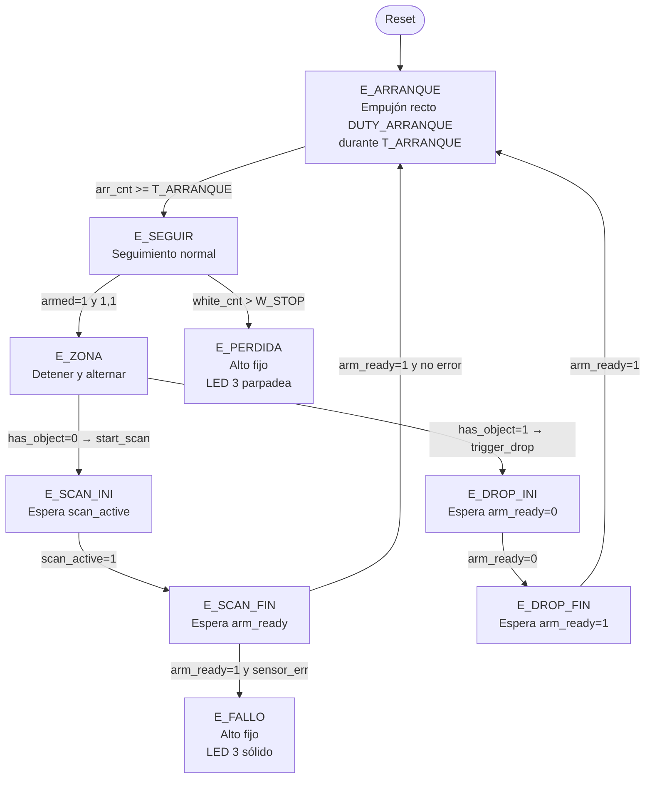

```
                                                                      
                                                                      
  ....................@@*...........................................  
  ...................=%.............................................  
  ...................@..@...........................................  
  ...................@...@..@.......................................  
  ...................*..@*...+......................................  
  ...................:.%.....@......................................  
  ...................@..............................................  
  ...................@.......@......@..@............................  
  ...................@.......@...@...%.:............................  
  ...................@.......@%......@.%............................  
  ...................@...@.-.......@@...............................  
  .....................@:=....@@#....*..............................  
  ....................*=@+.....%...+................................  
  ................@=.%......@....@..................................  
  ............@@.....*.........@....................................  
  ..........+%.............@::......................................  
  .........@@:........:...@....:.............@.@....................  
  .........@......*@+.@@.......@.............+.:.@..................  
  .........@.@@.....-.......@@...............+..@..@................  
  ........@.%#........-@@.....@.:%...........+...@...@..............  
  ........-....%@.......@............@...........@..@..@............  
  .......@.@:....:.-.....+.......*-...#..........@.....%.%+.........  
  ......@@.........=.@..@*.%....@....#........#...........*.@.......  
  .....@.....=......@...%......................@.............#@.....  
  ..:@.=.....#............-:.....%@@@@..........@......:@:..#=......  
  .@+@:.:...:@@=......@@:....@.%*.......@....................@......  
  .@......:%:.@:..@.+.....*....%@@@..@...*.......*.......@..%.......  
  ..@......@..@...@....@@.=@.@.%@@@@@@.....@....@@.....=....@.......  
  ...@......:=.@...+...........%.@@@@@@.....@.%....@..@....@........  
  ....@...@.....@.............:@...@@@@@@.....%.....=+..............  
  .....@@...........%..........@.....@@@@@@@%..%%%....@...@.........  
  .......@.........#.@.........@.......@@@@@@*..#....*@+@@..........  
  .........@.........@@...@@=..@.........#@@@@@@.+......@*..........  
  ...........@..........@@.....@...........=@@@@@@#....@.*..........  
  .............@.......@...@...@.........:@%..#....#..%..*..........  
  ...............*....@......@.@..@@@:...........+..#+...:..........  
  .................--...=@@@@@@@..@................@@%...:..........  
  ...................:+........:.@@...=@@@@..@.@@@@...@@@...........  
  ......................@......%..@@...@@@@@..=...@@..:@............  
  ........................@....@.%.@@@...@@@@.@@...@@..%............  
  ..........................@..@.+..%@@@..@@@@@:.....@..@...........  
  ............................@%@@@%..@@..@@*..:@...@@..@...........  
  ........................................#:.%%.....@+..@...........  
  ......................................:.:..%--@...-...@...........  
  ....................................#.#...@=..%@..-...@...........  
  .................................@..#.@....-:::.=.....@...........  
  ...............................@...=..#.-.......=.....-...........  
  .............................@...@...@.....@.+....@.*..-..........  
  ...........................@...@....@..@..@.:..-.@....@...#.......  
  ........................@.@.@@......@....@.:..-.+........#.@..@...  
  ....................................@........:..%.........%:..%@..  
  .........................@@@........#..+......@............@..-...  
  .......................................@...+...@.#-%..............  
  .......................................@...@....:.................  
  .....................................:.@.:.*....%@@...............  
  ....................................*...@....@:...................  
  ....................................:.......@:...:................  
  .....................................%.=-...@....:................  
  ..................................................................  
  ..................................................................  
                                                                      
                                                                    
```

# Robot Seguidor de Línea con Brazo Robótico

## Proyecto por Actronix09

---

## Índice

1. [Resumen](#resumen)
2. [Vistas del Sistema](#vistas-del-sistema)
3. [Arquitectura del Sistema](#arquitectura-del-sistema)
4. [Módulos VHDL](#módulos-vhdl)
   - [SeguidorLinea\_Brazo (Top)](#1-seguidorlinea_brazo-top)
   - [MaquinaEstados](#2-maquinaestados)
   - [LIDAR](#3-lidar)
   - [grab\_ctrl](#4-grab_ctrl)
   - [kinematics](#5-kinematics)
   - [polarPWM](#6-polarpwm)
5. [Máquina de Estados](#máquina-de-estados)
6. [Conversión Polar-PWM](#conversión-polar-pwm)
7. [Asignación de Pines](#asignación-de-pines)
8. [Lista de Materiales](#lista-de-materiales)
9. [Retroalimentación LEDs](#retroalimentación-leds)
10. [Referencias](#referencias-bibliográficas)

---

## Resumen

Este proyecto es un robot seguidor de línea autónomo con brazo robótico de 4 grados de libertad, controlado por FPGA Cyclone II EP2C5T144C7. Recorre una pista cerrada con línea negra y, al detectar una zona de recogida (línea blanca transversal), alterna entre localizar/agarrar un objeto con el escáner LIDAR 2D integrado en el brazo, y depositarlo en la siguiente zona.

**Características:**
- Navegación autónoma por pista cerrada en loop sobre línea negra.
- Detección de zona de recogida/depósito por línea blanca ancha transversal.
- Escáner LIDAR 2D con el propio brazo: barrido grueso + refinamiento fino.
- Cinemática FK+IK en hardware (CORDIC compartido) para posicionamiento del brazo.
- Lógica de alternancia: agarra en zonas sin objeto, deposita en zonas con objeto.
- Retroalimentación visual mediante 3 LEDs de placa (vida, acarreo, error).

---

## Vistas del Sistema

### Esquemático Eléctrico


*Figura 1: Diagrama esquemático del sistema mostrando la interconexión de sensores QRD1114, controlador L293D, reguladores de voltaje y conexiones a la FPGA.*

**Componentes principales:**
- **Sensores QRD1114:** Detectan la línea negra mediante reflexión infrarroja.
- **LM393:** Comparadores para señal digital de sensores.
- **L293D:** Puente H para control de motores DC.
- **VL53L0X:** Sensor de distancia por tiempo de vuelo (ToF), montado en el extremo del brazo.
- **Reguladores:** LD1117S50 para 5 V y LD1117AS33 para 3.3 V.

### PCB Diseñado


*Figura 2: Diseño de la PCB mostrando la distribución de componentes y ruteo de pistas. Dimensiones: 100 mm × 84 mm.*

### Modelo 3D del Robot


*Figura 3: Modelo 3D del robot con múltiples ángulos.*

**Ejes del brazo:**
- **Eje 1 (φ):** Base rotativa (azimut).
- **Eje 2 (θ₁):** Primer segmento (hombro).
- **Eje 3 (θ₂):** Segundo segmento (codo).
- **Eje 4 (θ₃):** Tercer segmento (muñeca) + pinza.

---

## Arquitectura del Sistema

```
+---------------------------------------------------------------------+
|  FPGA Cyclone II EP2C5T144C8                                        |
|                                                                     |
|  Sensores QRD1114 ──►  ┌───────────────────┐                        |
|                        │   MaquinaEstados  │ ──► Motores DC (L293)  |
|                        │  (seguidor+zonas) │                        |
|                        └──────┬────────┬───┘                        |
|               start_scan ─────┘        └─── trigger_drop            |
|                scan_active/arm_ready/has_object/sensor_err          |
|                        ┌──────▼──────────────────────────────┐      |
|  VL53L0X I2C ────────► │              LIDAR                  │      |
|                        │         (escáner 2D brazo)          │      |
|                        └── cmd_*/min_*/found/scan_done ───►┬─┘      |
|                                                            │        |
|                        ┌───────────────────────────────────▼────┐   |
|                        │            grab_ctrl                   │   |
|                        │   G_REST→SCANWAIT→IK→MOVE→GRIP→HOLD    │   |
|                        │             →DROP→RELEASE              │   |
|                        │   ┌──────────────┐                     │   |
|                        │   │  kinematics  │ (FK+IK, CORDIC 24b) │   |
|                        │   └──────────────┘                     │   |
|                        └─── phi/θ1/θ2/θ3/grip (MUX) ────►┬──────┘   |
|                                                          │          |
|                        ┌─────────────────────────────────▼───┐      |
|                        │   polarPWM (5 servos, rampa 1°/tick)│      |
|                        └──── PWM 50 Hz ──► 5 servomotores ───┘      |
|                                                                     |
+---------------------------------------------------------------------+
```

El top (`SeguidorLinea_Brazo`) aplica la inversión de `theta1` (`180 − θ₁`) antes de `polarPWM` porque ese servo está montado al revés mecánicamente.

---

## Módulos VHDL

### 1. SeguidorLinea_Brazo (Top)
**Archivo:** `Codigo/SeguidorLinea_Brazo.vhd`

Módulo superior (Etapa 2). Instancia y cablea todos los subsistemas: aplica la inversión de `theta1` y asigna los LEDs de la placa.

**Puertos:**
| Señal | Dir | Pin | Descripción |
|-------|-----|-----|-------------|
| `clk` | in | PIN_17 | Reloj 50 MHz |
| `reset` | in | PIN_144 | Reset activo bajo (pull-up interno) |
| `i2c_scl` | out | PIN_142 | I2C SCL → VL53L0X |
| `i2c_sda` | inout | PIN_136 | I2C SDA ↔ VL53L0X |
| `servo_phi` | out | PIN_118 | PWM base (φ) |
| `servo_theta1` | out | PIN_122 | PWM hombro (θ₁) |
| `servo_theta2` | out | PIN_126 | PWM codo (θ₂) |
| `servo_theta3` | out | PIN_132 | PWM muñeca (θ₃) |
| `servo_gripper` | out | PIN_134 | PWM pinza |
| `sensor_izq` | in | PIN_92 | QRD1114 izquierdo |
| `sensor_der` | in | PIN_90 | QRD1114 derecho |
| `motor_a1` | out | PIN_4 | Motor IZQ adelante (PWM) |
| `motor_a2` | out | PIN_8 | Motor IZQ reversa (=0 en práctica) |
| `motor_b1` | out | PIN_31 | Motor DER adelante (PWM) |
| `motor_b2` | out | PIN_24 | Motor DER reversa (=0 en práctica) |
| `led_1` | out | PIN_3 | LED vida (parpadeo 1 Hz); activo bajo |
| `led_2` | out | PIN_7 | LED acarreo (`has_object`); activo bajo |
| `led_3` | out | PIN_9 | LED error (`zona_fallo`); activo bajo |

**Señales internas clave:**
| Señal | Tipo | Descripción |
|-------|------|-------------|
| `reset_int` | std_logic | Reset activo alto para submódulos (`not reset`) |
| `start_scan` | std_logic | Pulso: MaquinaEstados → LIDAR: inicia barrido |
| `scan_active` | std_logic | '1' mientras el LIDAR escanea (MUX servo) |
| `scan_done` | std_logic | Pulso: barrido terminado |
| `found` | std_logic | '1' si `min_d < FOUND_TH` (hay objeto) |
| `scan_fault` | std_logic | '1' si el barrido abortó por watchdog |
| `cmd_phi/t1/t2/t3/grip` | std_logic_vector | Ángulos servo comandados por el LIDAR durante el barrido |
| `min_t1/min_d/min_phi` | std_logic_vector | Coordenadas polares crudas del punto más cercano |
| `trigger_drop` | std_logic | Pulso: MaquinaEstados → grab_ctrl: deposita objeto |
| `has_object` | std_logic | '1' mientras el brazo acarrea el cubo |
| `arm_ready` | std_logic | '1' en REST (libre) o HOLD |
| `reachable` | std_logic | '1' si el último objetivo era alcanzable |
| `phi_in/theta1_in/.../grip_in` | std_logic_vector/logic | Ángulos saliendo de grab_ctrl hacia polarPWM |
| `theta1_pwm` | std_logic_vector(7:0) | `180 − theta1_in`: compensación inversión servo θ₁ |
| `me_led_estado` | std_logic | LED vida de MaquinaEstados (1 Hz) |
| `me_zona_fallo` | std_logic | '1' = detenido por fallo de sensor VL53L0X |

---

### 2. MaquinaEstados
**Archivo:** `Codigo/MaquinaEstados.vhd`

Seguidor de línea simple con 2 sensores QRD DENTRO de la línea ancha, más detección de zona de recogida por línea blanca transversal. Alterna entre disparar el barrido LIDAR (sin objeto) y depositar el objeto (con objeto). Incluye empujón de arranque anti-atasco y temporizador de pérdida de línea.

**Generics:**
| Generic | Valor por defecto | Descripción |
|---------|-------------------|-------------|
| `DUTY_RECTO` | 30000 | Duty ciclo en recta (0..65535) |
| `DUTY_GIRO_EXT` | 29000 | Rueda exterior en curva |
| `DUTY_GIRO_INT` | 29000 | Magnitud rueda interior en curva |
| `MODO_PIVOTE` | true | `true` = pivote (interior en reversa); `false` = arco suave |
| `FILTRO_CYCLES` | 0 | Antirrebote sensor en ciclos de reloj (~0.3 ms @50 MHz) |
| `LINE_LVL` | '0' | Nivel lógico del QRD SOBRE la línea: `'0'`=negra, `'1'`=blanca |
| `DUTY_ARRANQUE` | 40000 | Duty del empujón recto de arranque (0 = desactiva) |
| `T_ARRANQUE` | 12\_500\_000 | Duración del empujón (~0.25 s @50 MHz) |
| `W_ARM_CYCLES` | 12\_500\_000 | Doble blanco mínimo para ARMAR la zona (~0.5 s) |
| `W_STOP_CYCLES` | 25\_000\_000 | Doble blanco que DETIENE el robot por pérdida (~1 s) |

**Puertos:**
| Señal | Dir | Descripción |
|-------|-----|-------------|
| `clk` | in | Reloj 50 MHz |
| `rst` | in | Reset activo alto |
| `sensor_izq / sensor_der` | in | Sensores QRD1114 (filtrados internamente) |
| `motor_a1 / motor_a2` | out | Motor IZQ: adelante / reversa (PWM con signo) |
| `motor_b1 / motor_b2` | out | Motor DER: adelante / reversa (PWM con signo) |
| `led_estado` | out | Parpadeo 1 Hz (sistema vivo) |
| `start_scan` | out | Pulso: inicia barrido LIDAR + agarre |
| `trigger_drop` | out | Pulso: deposita el objeto |
| `scan_active` | in | '1' mientras el LIDAR barre |
| `arm_ready` | in | '1' cuando el brazo terminó (HOLD o REST) |
| `has_object` | in | '1' mientras el brazo acarrea un objeto |
| `sensor_err` | in | '1' si el barrido falló (sensor no responde) |
| `zona_fallo` | out | '1' = detenido por fallo de sensor (LED error) |

**Señales internas clave:**
| Señal | Tipo | Descripción |
|-------|------|-------------|
| `flt_izq, flt_der` | integer | Contadores de antirrebote por sensor |
| `s_izq, s_der` | std_logic | Sensores filtrados: '1' = sobre la línea (=LINE_LVL) |
| `tgt_l, tgt_r` | integer (con signo) | Duty objetivo por rueda: + adelante, − reversa, 0 = freno |
| `pwm16` | unsigned(15:0) | Contador PWM libre de 16 bits (~763 Hz) |
| `clk_1s` | std_logic | Señal de 1 Hz para LED de vida |
| `cnt_1s` | integer | Contador divisor de 1 Hz (0..24\_999\_999) |
| `white_cnt` | integer | Ciclos acumulados de doble blanco (0,0) |
| `arr_cnt` | integer | Ciclos del empujón de arranque |
| `armed` | std_logic | '1' = doble blanco ≥ W\_ARM: zona ARMADA |
| `est` | est\_t | Estado actual de la FSM |
| `start_scan_r, trigger_drop_r` | std_logic | Registros de salida (un ciclo de pulso) |
| `TGT_GIRO_INT` | integer (const) | `f_int(MODO_PIVOTE, DUTY_GIRO_INT)`: negativo si pivote |

**Tabla de verdad sensores (s\_izq, s\_der):**
| s\_izq | s\_der | Acción |
|--------|--------|--------|
| 1 | 1 | AVANZAR (recto, ambos sobre la línea) |
| 1 | 0 | GIRAR IZQUIERDA (rueda izq. interior) |
| 0 | 1 | GIRAR DERECHA (rueda der. interior) |
| 0 | 0 | AVANZA (cruza franja blanca); si ≥ W\_ARM → ARMA zona |

**Estados FSM:**
`E_ARRANQUE` → `E_SEGUIR` → `E_ZONA` → `E_SCAN_INI` → `E_SCAN_FIN` → `E_ARRANQUE`
`E_ZONA` → `E_DROP_INI` → `E_DROP_FIN` → `E_ARRANQUE`
`E_SEGUIR` → `E_PERDIDA` (pérdida de línea) | `E_SCAN_FIN` → `E_FALLO` (sensor)

---

### 3. LIDAR
**Archivo:** `Codigo/LIDAR.vhd`

Escáner 2D con el brazo: mueve θ₁/φ en serpentina, promedia N mediciones por punto y entrega el punto de mínima distancia (cima del cubo) como coordenadas polares crudas. Realiza dos pasadas: barrido grueso → barrido fino centrado en el mínimo.

> **Cambio reciente:** `SETTLE_CYCLES` reducido de 12 500 000 a **5 000 000** ciclos (~250 ms de asentamiento por punto, antes ~500 ms). Reduce el tiempo total del barrido ~50 %.

**Generics:**
| Generic | Valor | Descripción |
|---------|-------|-------------|
| `CLK_FREQ_HZ` | 50\_000\_000 | Frecuencia del reloj |
| `I2C_FREQ_HZ` | 100\_000 | Frecuencia I2C |
| `PWRUP_CYCLES` | 500\_000 | Ciclos de power-up del sensor |
| `SETTLE_CYCLES` | **5\_000\_000** | Ciclos de asentamiento por punto (~250 ms) |
| `N_AVG` | 8 | Mediciones promediadas por punto |
| `COARSE_PHI_STEP` | 10 | Paso φ en barrido grueso (45→135°, 10 puntos) |
| `COARSE_T1_STEP` | 9 | Paso θ₁ en barrido grueso (90→45°, 6 puntos) |
| `FINE_PHI_STEP` | 3 | Paso φ en barrido fino |
| `FINE_T1_STEP` | 3 | Paso θ₁ en barrido fino |
| `FOUND_TH` | 200 | Umbral (mm): `min_d < FOUND_TH` ⟹ hay objeto |
| `WDOG_CYCLES` | 100\_000\_000 | Watchdog: aborta si el sensor no entrega medición en ~2 s |

**Puertos:**
| Señal | Dir | Descripción |
|-------|-----|-------------|
| `clk / rst` | in | Reloj / reset activo alto |
| `start_scan` | in | Pulso: inicia el barrido |
| `i2c_scl / i2c_sda` | out/inout | Bus I2C hacia VL53L0X |
| `scan_active` | out | '1' mientras escanea (el top usa esto como MUX servo) |
| `cmd_phi/theta1/theta2/theta3` | out | Ángulos absolutos servo durante el barrido |
| `cmd_grip` | out | '1' = garra ABIERTA durante el barrido |
| `min_t1 / min_d / min_phi` | out | Coordenadas polares crudas del punto más cercano |
| `found` | out | '1' si `min_d < FOUND_TH` y el barrido no abortó |
| `scan_done` | out | Pulso: barrido completado |
| `scan_fault` | out | '1' (latcheado) si el barrido fue abortado por watchdog |
| `dbg_meas_tick` | out | Conmuta por cada medición (LED de vida del sensor) |

**Señales internas clave:**
| Señal | Tipo | Descripción |
|-------|------|-------------|
| `distance_mm` | std_logic_vector(15:0) | Medición del VL53L0X en mm |
| `meas_tick` | std_logic | Conmuta por cada nueva medición del driver |
| `st` | st\_t | Estado de la FSM del escáner |
| `phi_cur, t1_cur` | integer | Posición actual de la rejilla de barrido |
| `phi_lo/hi, t1_lo/hi` | integer | Límites actuales de la rejilla |
| `phi_step, t1_step` | integer | Paso actual (grueso o fino) |
| `t1_dir` | integer (−1/1) | Dirección de θ₁ (serpentina gruesa / siempre +1 fino) |
| `fine_ph` | std_logic | '0' = barrido grueso en curso; '1' = barrido fino |
| `best_d, best_phi, best_t1` | variables | Mínimo acumulado del barrido |
| `settle_cnt` | integer | Contador de asentamiento del servo |
| `acc, navg` | unsigned/integer | Acumulador y contador de promediado |
| `discard1` | std_logic | '1' = descartar la primera medición del punto (transición) |
| `avg_val` | unsigned(15:0) | Promedio de las N\_AVG mediciones del punto actual |
| `wdog, aborted` | integer/std_logic | Watchdog del sensor: aborta si se atasca |
| `scan_fault_r` | std_logic | Registro latcheado de fallo por watchdog |

**θ₂ acoplado:** durante el barrido `cmd_theta2 = 90 − θ₁` (L2 siempre horizontal), `cmd_theta3 = 0` (haz vertical hacia abajo).

**Estados FSM:**
`S_IDLE` →(start\_scan) `S_MOVE` → `S_SETTLE` → `S_AVG` →(N\_AVG ok) `S_NEXT` → `S_MOVE` (siguiente punto)
`S_AVG` →(watchdog) `S_DONE`
`S_NEXT` →(rejilla terminada y fino) `S_DONE` → `S_IDLE`

---

### 4. grab_ctrl
**Archivo:** `Codigo/grab_ctrl.vhd`

Orquestador del ciclo del brazo. Espera el resultado del barrido, invoca `kinematics`, mueve el brazo al objeto, cierra la garra y queda en modo acarreo (HOLD). Cuando recibe `trigger_drop`, deposita el objeto y regresa a reposo. Multiplexa los ángulos de servo entre el LIDAR (durante el barrido) y la pose propia (resto del tiempo).

**Generics:**
| Generic | Valor | Descripción |
|---------|-------|-------------|
| `MOVE_CYCLES` | 125\_000\_000 | Tiempo para que el brazo llegue a la pose (~2.5 s) |
| `GRIP_CYCLES` | 75\_000\_000 | Tiempo de cierre/apertura de la garra (~1.5 s) |
| `DROP_PHI` | 100 | φ de depósito (gira a la derecha) |
| `DROP_T1` | 45 | θ₁ de depósito (brazo extendido) |
| `DROP_T2` | 45 | θ₂ de depósito |
| `DROP_T3` | 0 | θ₃ de depósito |

**Puertos:**
| Señal | Dir | Descripción |
|-------|-----|-------------|
| `clk / rst` | in | Reloj / reset activo alto |
| `scan_active / scan_done / found` | in | Del LIDAR |
| `min_t1 / min_d / min_phi` | in | Coordenadas crudas del mínimo |
| `cmd_phi/.../cmd_grip` | in | Ángulos servo del LIDAR (durante barrido) |
| `trigger_drop` | in | Pulso de MaquinaEstados: deposita |
| `phi_out/.../grip_out` | out | Ángulos muxeados → polarPWM |
| `has_object` | out | '1' mientras acarrea el cubo |
| `arm_ready` | out | '1' en G\_REST (libre) o G\_HOLD |
| `reachable` | out | '1' si el último objetivo era alcanzable |

**Señales internas clave:**
| Señal | Tipo | Descripción |
|-------|------|-------------|
| `ik_start / ik_done / reach` | std_logic | Handshake con `kinematics` |
| `gphi, gt1, gt2, gt3` | std_logic_vector(7:0) | Ángulos de salida de `kinematics` |
| `gst` | gst\_t | Estado actual de la FSM del brazo |
| `tmr` | integer | Temporizador para esperas de MOVE/GRIP |
| `grab_phi/.../grab_grip` | std_logic_vector/logic | Pose actual del brazo |
| `has_obj_r` | std_logic | Registro interno de `has_object` |
| `reach_latch` | std_logic | Último resultado de alcance de `kinematics` |
| `TMR_MAX` | constant | `max(MOVE_CYCLES, GRIP_CYCLES)` para el rango del temporizador |

**Convención garra:** `grab_grip='0'` = CERRADA, `grab_grip='1'` = ABIERTA (validado en TestBrazo).

**MUX de servos:** durante `scan_active='1'` los ángulos salen de LIDAR (`cmd_*`); en cualquier otro estado salen de la pose del `grab_ctrl`.

**Estados FSM:**
`G_REST` →(scan\_active) `G_SCANWAIT` →(found) `G_IK` → `G_IK_WAIT` →(alcanzable) `G_MOVE` → `G_GRIP` → `G_HOLD`
`G_HOLD` →(trigger\_drop) `G_DROP` → `G_RELEASE` → `G_REST`
`G_SCANWAIT` →(no found) `G_REST` | `G_IK_WAIT` →(no alcanzable) `G_REST`

---

### 5. kinematics
**Archivo:** `Codigo/kinematics.vhd`

Cinemática fusionada FK+IK del brazo. A partir de las coordenadas polares crudas del barrido (θ₁\*, d\*, φ\*) calcula los ángulos de servo que llevan la garra al objeto con aproximación vertical hacia abajo. Reutiliza un único CORDIC vectoring de 24 bits con 14 iteraciones en tres pasadas: FK (hypot+atan), IK muñeca (hypot+atan), IK codo (hypot+atan). Las ROMs de cos/sin y arccos con salida registrada se mapean a bloques M4K.

**Generics:**
| Generic | Valor | Descripción |
|---------|-------|-------------|
| `L1` | 100 mm | Longitud eslabón 1 (eje θ₁ → eje θ₂) |
| `L2` | 100 mm | Longitud eslabón 2 (eje θ₂ → eje θ₃) |
| `L3` | **43 mm** | Eje θ₃ → cara sensor (63−20: sensor reubicado 2026-06-16) |
| `L_GRIP` | 90 mm | Eje θ₃ → punta de la garra (sin cambio) |
| `ALFA3_TGT` | −90° | Orientación absoluta de la garra al agarrar (vertical abajo) |
| `Z_DROP` | **60 mm** | Descenso de la garra bajo la cima del objeto |
| `R_TRIM` | **15 mm** | Recorte radial del objetivo (compensa over-reach) |
| `PHI_TRIM` | **−1°** | Corrección offset lateral del sensor |

**Puertos:**
| Señal | Dir | Descripción |
|-------|-----|-------------|
| `clk / rst` | in | Reloj / reset activo alto |
| `start` | in | Pulso: inicia cálculo |
| `in_t1 / in_d / in_phi` | in std_logic_vector | θ₁\*, d\* (mm), φ\* del barrido |
| `o_phi / o_theta1 / o_theta2 / o_theta3` | out | Ángulos servo calculados (0..180°) |
| `reachable` | out | '0' si el objetivo está fuera del alcance (L1+L2) |
| `done` | out | Pulso: cálculo terminado |

**Señales internas clave:**
| Señal | Tipo | Descripción |
|-------|------|-------------|
| `xi, yi, zi` | signed(23:0) | Registros del CORDIC (datapath 24b) |
| `it` | integer | Iteración actual del CORDIC (0..NITER−1) |
| `cordic_ret` | st\_t | Estado al que retorna tras el CORDIC |
| `trig_idx` | integer | Índice en ROM cos/sin: `ángulo − ANG_LO` (ANG\_LO=−90) |
| `acos_idx` | integer | Índice en ROM arccos: D en mm (0..REACH) |
| `cosrom_q / sinrom_q` | signed(13:0) | Salida registrada ROM cos/sin (Q12) |
| `acosrom_q` | unsigned(7:0) | Salida registrada ROM arccos (grados) |
| `r_fk / th_fk` | integer | Radio y ángulo resultantes de la FK (mm, grados) |
| `rw / zw` | integer | Coordenadas de la muñeca tras la IK (mm) |
| `t1d` | integer | θ₁ calculado (grados, antes de clamp) |
| `phi_l` | std_logic_vector(7:0) | φ con PHI\_TRIM aplicado |
| `reach_r` | std_logic | Registro de `reachable` |
| `COS_ROM / SIN_ROM` | trig\_rom\_t | ROM cos/sin Q12, rango −90..180° (271 entradas) |
| `ACOS_ROM` | acos\_rom\_t | ROM arccos(D/REACH), D=0..200 (201 entradas, 8b) |
| `ATAN_LUT` | atan\_t | LUT atan(2⁻ⁱ) Q8 para CORDIC (14 entradas, en lógica) |
| `INV_GAIN` | 2487 | 1/(16·K) en Q16 (K = ganancia CORDIC tras 14 iter.) |

**Algoritmo (secuencia de estados):**
1. **FK:** `cos/sin(θ₁*)` → CORDIC → `(r_fk, th_fk)` = radio y ángulo del objetivo respecto al eje θ₁.
2. **IK muñeca:** `cos/sin(th_fk)` → CORDIC → `(rw, zw)` + ROM arccos → `θ₁`.
3. **IK codo:** `cos/sin(θ₁)` → posición eslabón L1 → CORDIC → `alfa2` → `θ₂`, `θ₃`.

**Estados FSM:**
`S_IDLE` → `S_FK_W` → `S_FK` → `S_CORDIC` → `S_FK_POST` → `S_IK_SET` → `S_IK_W` → `S_IK` → `S_CORDIC` → `S_ACOS_SET` → `S_ACOS_W` → `S_THETA1` → `S_LUT2_W` → `S_ELBOW` → `S_CORDIC` → `S_POST2` → `S_DONE` → `S_IDLE`

---

### 6. polarPWM
**Archivo:** `Codigo/polarPWM.vhd`

Genera 5 canales PWM de 50 Hz (20 ms) para los servomotores con movimiento progresivo por rampa (1° por tick de rampa). Recibe ángulos absolutos 0–180° y los aplica con rampa para proteger el torque. La inversión mecánica de θ₃ se aplica aquí (`tgt_t3 = 180 − theta3_in`); la inversión de θ₁ la aplica el top antes de llamar a este módulo.

**Especificaciones PWM:**
| Parámetro | Valor | Tiempo |
|-----------|-------|--------|
| Periodo | 1 000 000 ciclos | 20 ms (50 Hz) |
| Mínimo (0°) | 25 000 ciclos | 0.5 ms |
| Máximo (180°) | 125 000 ciclos | 2.5 ms |
| Paso | 556 ciclos/° | — |
| Tick de rampa | 500 000 ciclos | 10 ms/° ≈ 100°/s |

**Convención garra:**
| `grip_cmd` | Ángulo interno | Posición |
|-----------|----------------|----------|
| '0' | 0° (`GRIP_OPEN`) | Abierta |
| '1' | 99° (`GRIP_CLOSE`) | Cerrada (~55%) |

**Puertos:**
| Señal | Dir | Descripción |
|-------|-----|-------------|
| `clk / rst` | in | Reloj / reset activo alto |
| `phi_in` | in | Ángulo absoluto base φ (0–180°) |
| `theta1_in` | in | Ángulo absoluto θ₁ hombro (ya invertido por el top) |
| `theta2_in` | in | Ángulo absoluto θ₂ codo |
| `theta3_in` | in | Ángulo absoluto θ₃ muñeca (se invierte internamente: 180−θ₃) |
| `grip_cmd` | in | '0'=abierta, '1'=cerrar |
| `pwm_phi/theta1/theta2/theta3/gripper` | out | Señales PWM → servomotores |

**Señales internas clave:**
| Señal | Tipo | Descripción |
|-------|------|-------------|
| `tgt_phi/t1/t2/t3/grip` | integer (0..180) | Ángulos objetivo leídos de las entradas |
| `cur_phi/t1/t2/t3/grip` | integer (0..180) | Ángulos actuales (siguen a tgt con rampa) |
| `ramp_cnt` | integer | Contador del tick de rampa (0..RAMP\_STEP−1) |
| `ramp_tick` | std_logic | Pulso de 1 ciclo cada RAMP\_STEP: avanza la rampa 1° |
| `cuenta` | integer | Contador PWM (0..PWM\_PERIOD−1) |
| `r_phi/t1/t2/t3/grip` | std_logic | Registros de salida PWM |
| `ANGLE_PWM` | angle\_pwm\_t | LUT ángulo→ciclos: `PWM_MIN + i × PWM_STEP` (181 entradas) |

**Procesos:**
1. `read_targets`: registra las entradas → `tgt_*` (con inversión de θ₃).
2. `gen_ramp_tick`: genera el tick de rampa cada `RAMP_STEP` ciclos.
3. `interpolate`: avanza `cur_*` 1° hacia `tgt_*` por cada `ramp_tick`.
4. `gen_pwm`: compara `cuenta` con `ANGLE_PWM(cur_*)` → salidas PWM.

**Inicialización en HOME** (sin salto al encender): `cur_phi=180`, `cur_t1=90`, `cur_t2=0`, `cur_t3=180`, `cur_grip=GRIP_CLOSE`.

---

## Máquina de Estados


```mermaid
flowchart TD
    RST(["Reset"]) --> A

    A["E_ARRANQUE\nEmpujón recto DUTY_ARRANQUE\ndurante T_ARRANQUE"]
    B["E_SEGUIR\nSeguimiento normal"]
    C["E_ZONA\nDetener y alternar"]
    D["E_SCAN_INI\nEspera scan_active"]
    E["E_SCAN_FIN\nEspera arm_ready"]
    F["E_DROP_INI\nEspera arm_ready=0"]
    G["E_DROP_FIN\nEspera arm_ready=1"]
    H["E_PERDIDA\nAlto fijo\nLED 3 parpadea"]
    I["E_FALLO\nAlto fijo\nLED 3 sólido"]

    A -->|arr_cnt >= T_ARRANQUE| B
    B -->|armed=1 y 1,1| C
    B -->|white_cnt > W_STOP| H

    C -->|has_object=0 → start_scan| D
    C -->|has_object=1 → trigger_drop| F

    D -->|scan_active=1| E
    E -->|arm_ready=1 y no error| A
    E -->|arm_ready=1 y sensor_err| I

    F -->|arm_ready=0| G
    G -->|arm_ready=1| A
```

**Detección de zona:**
La zona se ARMA cuando el doble blanco (0,0) supera `W_ARM_CYCLES` (~0.5 s): `armed='1'`.
Se DISPARA cuando ambos sensores vuelven a la línea (1,1) con `armed='1'`.

**Transiciones clave:**
| Condición | Transición |
|-----------|------------|
| `white_cnt ≥ W_ARM` | Arma zona (armed='1') |
| Regresa a (1,1) con armed='1' | E\_SEGUIR → E\_ZONA |
| `white_cnt > W_STOP` | E\_SEGUIR → E\_PERDIDA |
| `scan_active = '1'` | E\_SCAN\_INI → E\_SCAN\_FIN |
| `arm_ready = '1'` sin error | E\_SCAN\_FIN → E\_ARRANQUE |
| `sensor_err = '1'` | E\_SCAN\_FIN → E\_FALLO |
| `arm_ready = '0'` (drop arrancó) | E\_DROP\_INI → E\_DROP\_FIN |
| `arm_ready = '1'` (drop terminó) | E\_DROP\_FIN → E\_ARRANQUE |

---

## Conversión Polar-PWM

El módulo `polarPWM` convierte ángulos absolutos (0–180°) a señales PWM para los 5 servomotores con movimiento progresivo.

**Especificaciones:**
- Frecuencia: 50 Hz (20 ms).
- Pulso mínimo: 0.5 ms → 0°.
- Pulso máximo: 2.5 ms → 180°.
- Resolución: 556 ciclos/°.
- Rampa: 500 000 ciclos/° ≈ 100°/s.

**Tabla de conversión:**
| Ángulo | Ciclos | Tiempo de pulso |
|--------|--------|-----------------|
| 0° | 25 000 | 0.50 ms |
| 45° | 50 020 | 1.00 ms |
| 90° | 75 040 | 1.50 ms |
| 135° | 100 060 | 2.00 ms |
| 180° | 125 000 | 2.50 ms |

---

## Asignación de Pines

> Fuente autorizada: `Codigo/SeguidorLinea_Brazo.qsf`. FPGA: Cyclone II **EP2C5T144C8**, placa RZ-EasyFPGA A2.2.

| Componente | Señal VHDL | Pin FPGA | Dirección | Notas |
|------------|------------|----------|-----------|-------|
| **Reloj** | `clk` | PIN_17 | IN | 50 MHz |
| **Reset** | `reset` | PIN_144 | IN | Activo bajo, pull-up interno |
| **I2C VL53L0X** | `i2c_scl` | PIN_142 | OUT | 100 kHz |
| | `i2c_sda` | PIN_136 | INOUT | Bidireccional |
| **Servomotores** | `servo_phi` | PIN_118 | OUT | Base φ |
| | `servo_theta1` | PIN_122 | OUT | Hombro θ₁ (invertido en top) |
| | `servo_theta2` | PIN_126 | OUT | Codo θ₂ |
| | `servo_theta3` | PIN_132 | OUT | Muñeca θ₃ |
| | `servo_gripper` | PIN_134 | OUT | Pinza |
| **Sensores línea** | `sensor_izq` | PIN_92 | IN | QRD1114 izquierdo |
| | `sensor_der` | PIN_90 | IN | QRD1114 derecho |
| **Motores DC** | `motor_a1` | PIN_4 | OUT | Motor IZQ adelante (PWM) |
| | `motor_a2` | PIN_8 | OUT | Motor IZQ reversa |
| | `motor_b1` | PIN_31 | OUT | Motor DER adelante (PWM) |
| | `motor_b2` | PIN_24 | OUT | Motor DER reversa |
| **LEDs placa** | `led_1` | PIN_3 | OUT | Vida 1 Hz (activo bajo) |
| | `led_2` | PIN_7 | OUT | Has object (activo bajo) |
| | `led_3` | PIN_9 | OUT | Error / zona fallo (activo bajo) |

---

## Lista de Materiales

- ALTERA FPGA Cyclone II **EP2C5T144C7** (RZ-EasyFPGA A2.2).
- PCB personalizada.
- Piezas de impresión 3D en PLA y TPU.
- Insertos de latón M2 y M3.
- Tornillos M2, M3 y M4.
- Tuercas M3 y M4.
- Motores reductores DC.
- Capacitor Electrolítico 16 V (470 µF, 100 µF, 1000 µF).
- Capacitor Cerámico 50 V 100 nF.
- Jack DC Hembra DC-005-2.1.
- Base Socket DIP-16 y DIP-8.
- LM393P Comparador Diferencial Dual.
- Tira Header Macho y Hembra 2.54 mm.
- Plug DC 5.5 mm × 2.1 mm.
- STPS0560Z Diodo 60 V 500 mA SMD.
- LD1117AL Regulador 3.3 V 1 A.
- L7806CV Regulador 6 V 1.2 A.
- Resistor 470 Ω 1/4 W 1206 SMD.
- Resistor 10 kΩ 1/4 W 1206 SMD.
- LED Rojo SMD 1206.
- Potenciómetro de Precisión 3362P 10 k.
- Conector XT30 Par Macho Hembra.
- Batería 18650 7.4 V 2S1P 2200 mAh.
- Conectores Dupont Hembra 2.54 mm (3P, 4P, 7P).
- Servomotor SG90 RC 9 g × 5 unidades.
- Separador de Latón M3 (5 mm, 10 mm, 20 mm).
- CY-15A Rueda Loca Universal de Metal.
- **VL53L0X** Sensor de Distancia por Tiempo de Vuelo (ToF).
- Alambre de Cobre 30 AWG.

---

## Retroalimentación LEDs

El sistema incluye 3 LEDs de la placa RZ-EasyFPGA para diagnóstico (activo bajo: '0' enciende):

| LED | Pin | Señal | Estado | Significado |
|-----|-----|-------|--------|-------------|
| LED 1 | PIN_3 | `led_1` | Parpadeo 1 Hz | Sistema en operación (vivo) |
| LED 2 | PIN_7 | `led_2` | Encendido | El brazo acarrea un objeto (`has_object`) |
| LED 3 | PIN_9 | `led_3` | Sólido | Error: sensor VL53L0X no respondió (`E_FALLO`) |
| LED 3 | PIN_9 | `led_3` | Parpadeo 1 Hz | Pérdida de línea (`E_PERDIDA`) |

**Diagnóstico rápido:**
| LED 1 | LED 2 | LED 3 | Significado |
|-------|-------|-------|-------------|
| Parpadeando | Apagado | Apagado | Siguiendo la línea normalmente |
| Parpadeando | Encendido | Apagado | Acarreando el objeto |
| Apagado | — | Apagado | Sin energía o reset activo |
| Parpadeando | — | Parpadeo | Pérdida de línea (E\_PERDIDA) |
| Parpadeando | — | Sólido | Fallo sensor VL53L0X (E\_FALLO) |

---

## Archivos del Proyecto

```
SeguidorLinea_Brazo/
├── Codigo/
│   ├── SeguidorLinea_Brazo.vhd     # Top (Etapa 2 — producción)
│   ├── MaquinaEstados.vhd          # Seguidor + zonas + handshake brazo
│   ├── LIDAR.vhd                   # Escáner 2D + driver VL53L0X
│   ├── grab_ctrl.vhd               # Orquestador del ciclo del brazo
│   ├── kinematics.vhd              # FK+IK (CORDIC compartido)
│   ├── polarPWM.vhd                # 5 servos PWM con rampa
│   ├── VL53L0X.vhd                 # Driver I2C del sensor ToF
│   ├── vl53l0x_pkg.vhd             # Package del driver
│   ├── encoder_servo.vhd           # Encoder de posición servo
│   ├── SeguidorLinea_Brazo.qsf     # Asignación de pines y proyecto Quartus
│   ├── Pruebas/                    # Tops de prueba y testbenches
│   │   ├── Brazo/                  # tb_grab_ctrl, tb_kinematics, TestBrazo
│   │   ├── Lidar/                  # LIDAR_GrabLoop_Top (top de síntesis actual)
│   │   ├── Motores/                # TestMotores
│   │   ├── Seguidor/               # tb_MaquinaEstados
│   │   └── Sensor/                 # tb_VL53L0X
│   └── _backups/                   # Versiones anteriores de módulos
├── Imagenes/                       # Renderizados y esquemáticos
├── Documentos/                     # PDFs y archivos STL
├── README.md                       # Esta documentación
└── LICENSE                         # Licencia MIT
```

> **Nota1:** El `TOP_LEVEL_ENTITY` activo en el QSF puede estar apuntando a algun módulo de prueba durante el desarrollo. Para síntesis de producción cambiar a `SeguidorLinea_Brazo`.

> **Nota2:** El diseño actual presente en el repositorio actual de GitHub tiene multiples fallas que necesitan ser solucionadas las cuales se fueron descubriendo durante el desarrollo de este proyecto, todos los cambios necesarios para un funcionamiento correcto del proyecto seran agregados a una futura iteración de este proyecto la cual esta disponible en este mismo repositorio.

## Licencia

Este proyecto está bajo la [Licencia MIT](LICENSE). Eres libre de:
- Usar el proyecto con fines personales o comerciales.
- Modificar el código, PCB y diseños.
- Distribuir copias.
- Vender productos basados en este proyecto.

**Único requisito:** Incluir el aviso de licencia original.

---

## Referencias Bibliográficas

1. Altera Corporation. "Cyclone II Device Handbook." Intel/Altera, 2007.
2. Pololu Corporation. "QRD1114 Reflective Optical Sensor." Datasheet.
3. STMicroelectronics. "VL53L0X Time-of-Flight Ranging Sensor." Datasheet, Rev 3, 2016.
4. Texas Instruments. "L293D Quadruple Half-H Driver." Datasheet, 2016.
5. IEEE Standard 1076-2008. "VHDL Language Reference Manual."
6. Volder, J. E. "The CORDIC Trigonometric Computing Technique." *IRE Transactions on Electronic Computers*, 1959.

---

**Última actualización:** 18 de junio del 2026
